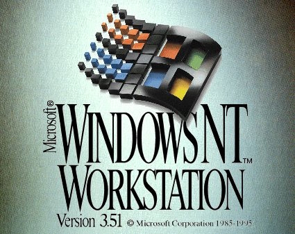

# Windows NT 3.51 Updates, Fixes and More

A curated set of updates, service packs, drivers, and installation guidance for Windows NT 3.51.

## Contents

- [VMWare Usage Guide](VMWare.md)
- [Service Packs](ServicePacks.md)
- [Drivers](Drivers.md)
- [Post Service Pack 5 Updates](#post-service-pack-5-updates)
- [Shell Updates](#shell-updates)

## VMWare Usage Guide

Guidance for installing and running Windows NT 3.51 in VMWare.

- [VMWare Usage Guide](VMWare.md)

## Service Packs

Service pack details, installation notes, and post-SP recommendations.

- [Service Packs](ServicePacks.md)

## Drivers

Driver collection, compatibility notes, and installation tips for NT 3.51.

- [Drivers](Drivers.md)

## Post Service Pack 5 Updates

Add additional updates, fixes, and tools released after Service Pack 5.

## Shell Updates

Document shell enhancements, updates, and tweaks for Windows NT 3.51.
