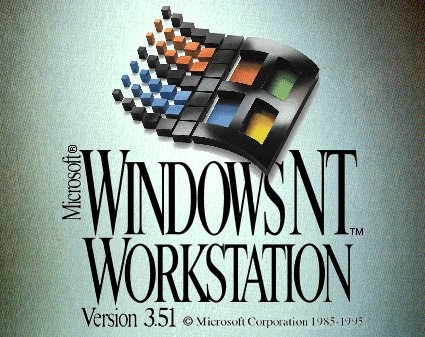

# Windows NT 3.51 Updates, Fixes and More

# **Contents**

**VMWare Usage Guide**

- [VMWare](https://github.com/InstallingEverything/WindowsNT3.51/blob/main/VMWare.md)

**Service Packs**

- [Service Packs](https://github.com/InstallingEverything/WindowsNT3.51/blob/main/ServicePacks.md)

**Drivers**

- [Drivers](https://github.com/InstallingEverything/WindowsNT3.51/blob/main/Drivers.md)

**Post Service Pack 5 Updates**

**Shell Updates**

- 
- 
- 
