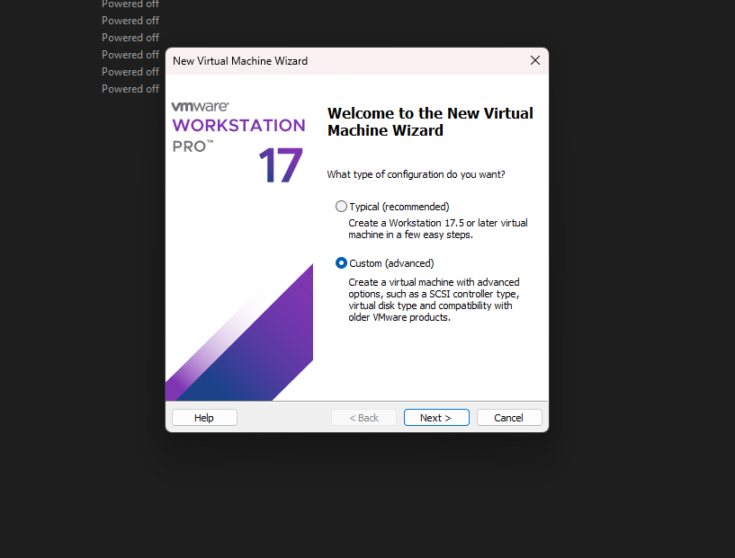
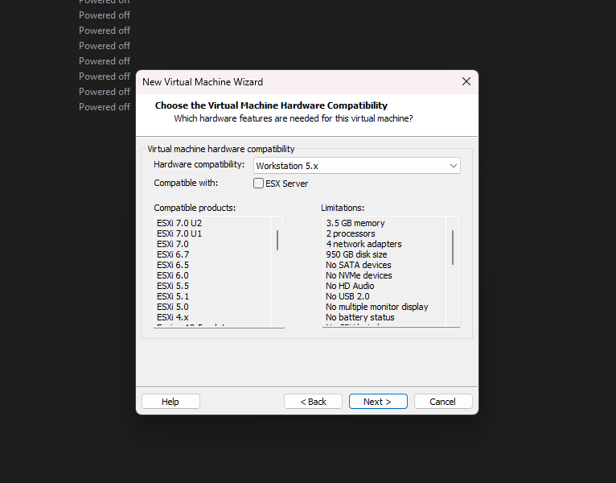
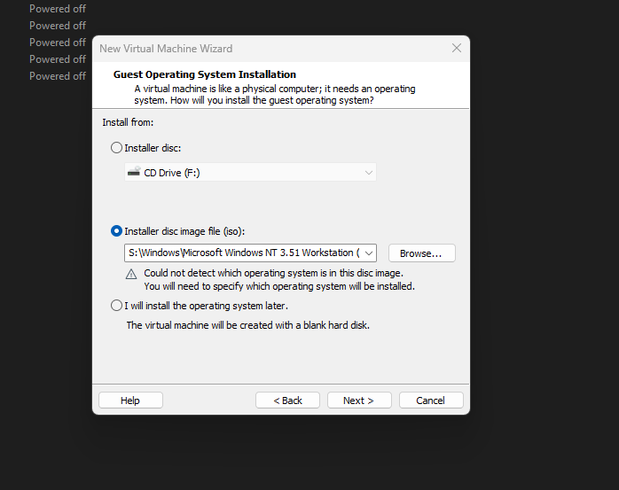
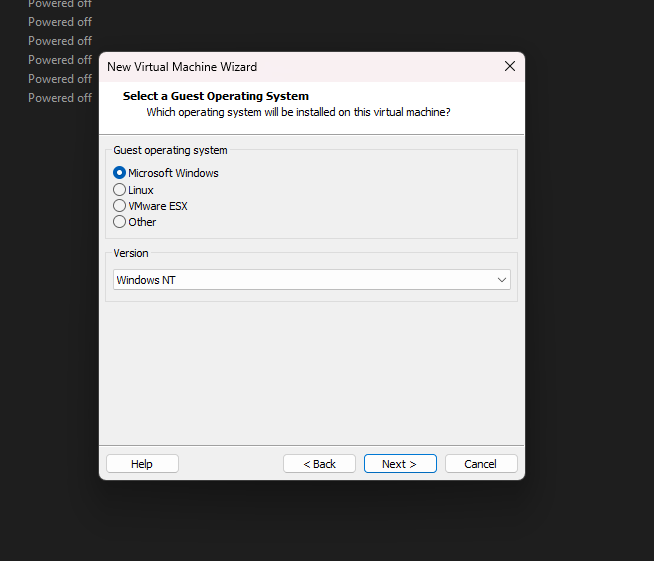
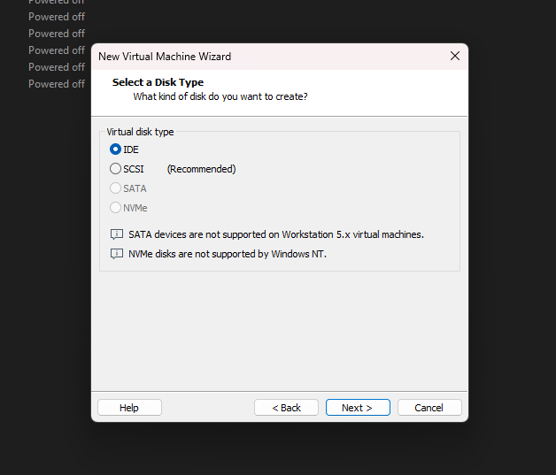
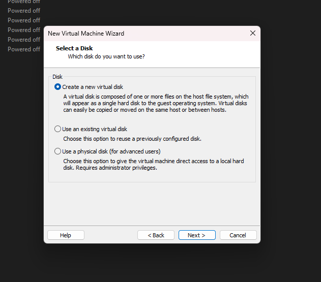
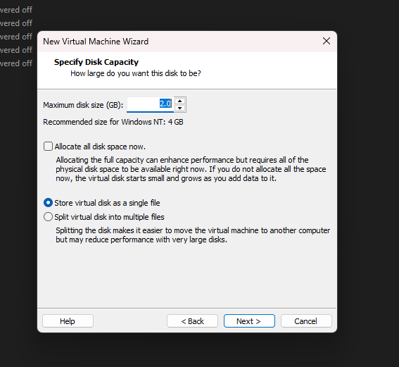
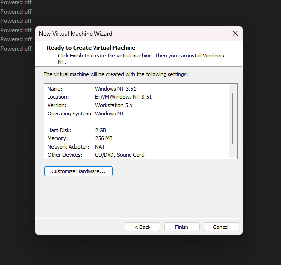
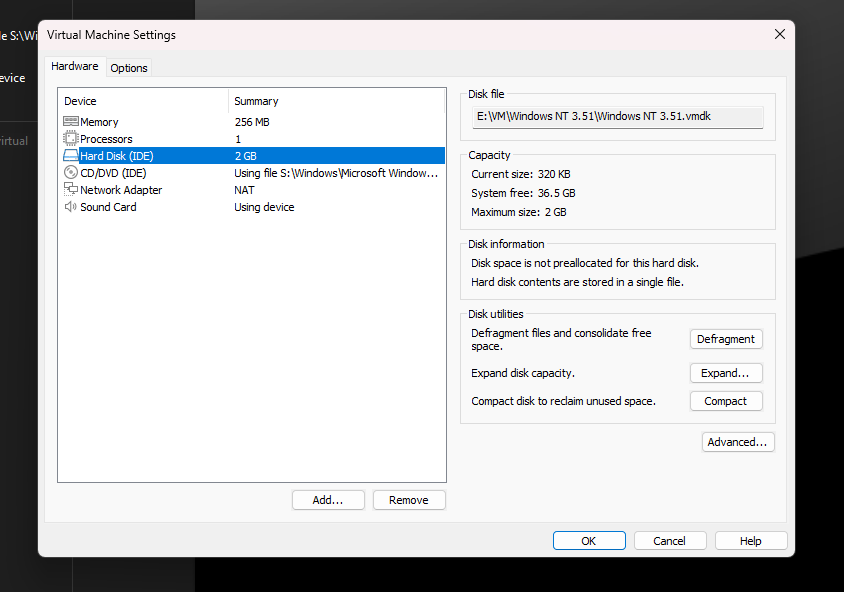
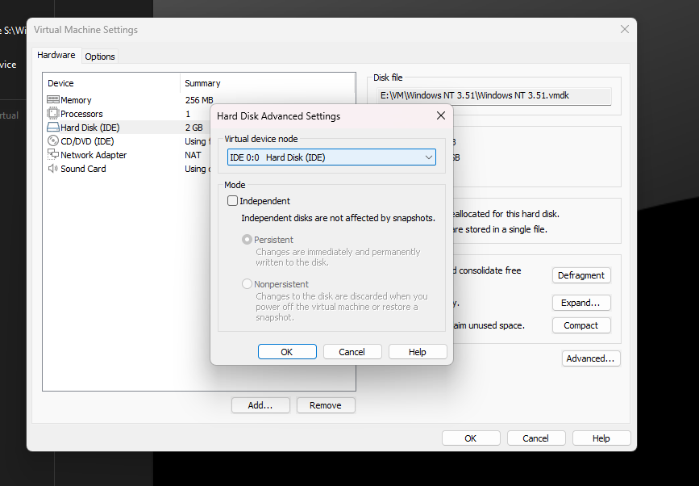

# Installing Windows NT 3.51 on VMWare Workstation

Getting Windows NT 3.51 to install cleanly on modern VMWare Workstation can be tricky. This guide covers the setup options we tested successfully.

## Requirements

- VMWare Workstation
- Windows NT 3.51 installation ISO
- A new virtual machine configured for older Windows guests

## Step-by-step setup

1. Create a new virtual machine and choose `Custom` install.

2. Set the virtual hardware compatibility dropdown to `Workstation 5.x`.

3. Attach your Windows NT 3.51 ISO as the installation media.

4. Choose `Windows NT` from the Windows guest operating system dropdown and continue.

5. When selecting the hard disk type, make sure `IDE` is selected.

6. Create a new virtual disk for the guest.

7. For disk size, 2 GB is a reliable choice. Larger disks can work but may cause issues.
   Also ensure `Store virtual disk as a single file` is enabled.

8. Finish the VM creation wizard.

9. Before starting the VM, open the virtual machine settings and select the hard disk, then choose `Advanced`.

10. Confirm the disk is set to `IDE 0:0`. If it is not, you may encounter installation or Service Pack update issues later.

## Notes

- A single-file virtual disk is more compatible with older Windows NT builds.
- Use `IDE 0:0` for the primary disk to avoid installer and post-install update problems.
- After these settings are confirmed, the machine should boot into the Windows NT 3.51 installer successfully.
