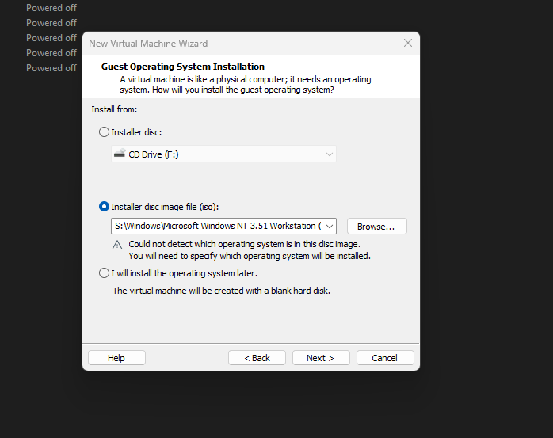

# **Getting NT 3.51 to install on VMWare Workstation**

Getting Windows NT 3.51 to install on VMWare workstation can be a challenge.

Here is a list of all the things we found in our testing and how we got it working.

1. Creating a new VM and choose Custom install.

2. Change the dropdown to Workstation 5.x.

3. Select your ISO as normal.

4. Select Windows NT from the Windows drop down and carry on.

5. Make sure IDE is selected when you get to the HDD section.

6. Create a new Virtual Disk

7. On this section i tend to chose a disk size of 2tb bigger works but i have run into issues.  Also make sure store in a single file is ticked.

8. Finish creating the VM

9. Once the machine has created go back into the setting for the VM (DO NOT Start) and choose Advanced under Hard Disk.

10. Make sure Disk is set at IDE 0.0.  If it is not you will have issues when installing later Service Packs.

